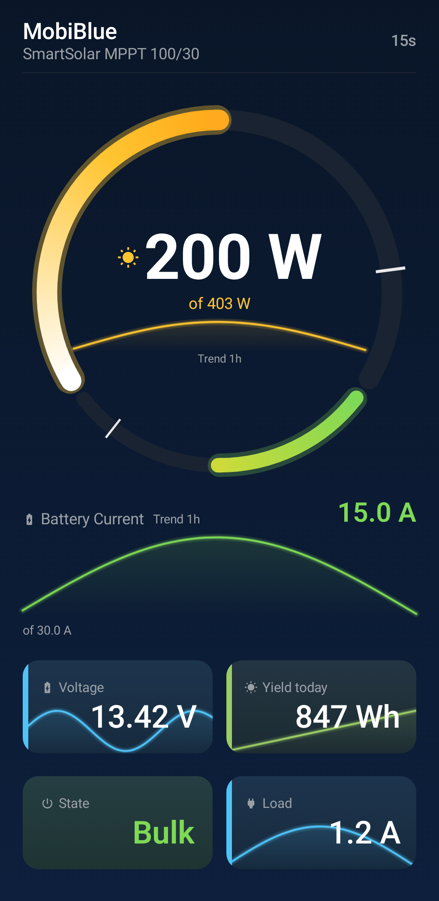
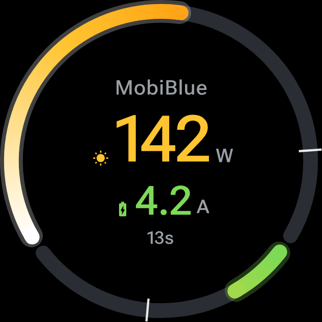
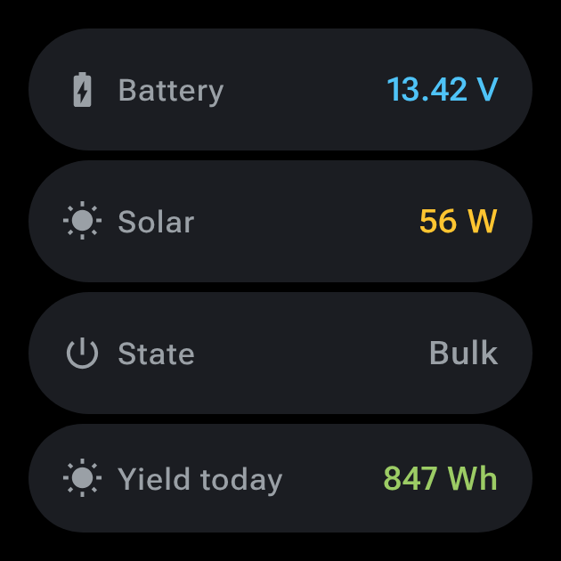
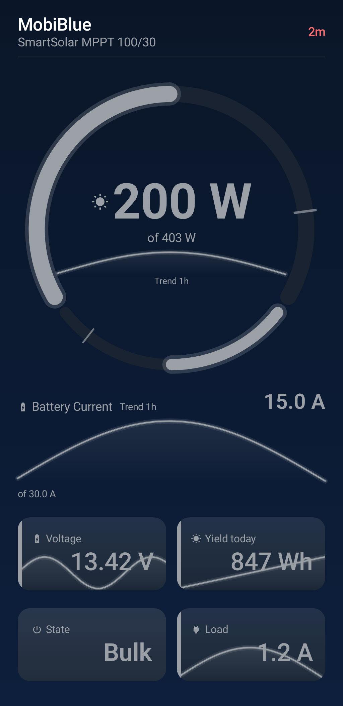

# Victron MPPT SmartWatch Monitor

Read a Victron **SmartSolar / BlueSolar MPPT** straight from your wrist — connectionless, over the
device's BLE *Instant Readout* advertisements. A Wear OS **tile** shows solar power, battery
voltage/current, charger state and today's yield at a glance; the full watch app scrolls down
into all values, device discovery and key entry; the phone app gives you a fullscreen animated
dashboard.

<p align="center">
  
  &nbsp;&nbsp;
  
  &nbsp;&nbsp;
  
</p>

* No connection to the charger: VictronConnect keeps working while you watch.
* No phone required — the watch app is standalone and scans with the watch's own radio.
* No IDE required — everything builds in Docker with one script.
* **Phone dashboard** — auto-navigates to a fullscreen view with two glowing arc gauges (power and
  battery current, the same pair the watch draws), trend graphs on every metric that grow to cover
  the whole day, and swipe between devices.
* **Watch face** — full-bezel power gauge with large watts and amps, scrolls down into a detail list with all values.

The tile draws the same gauge, so tile and app never look like two different apps.

### Stale data is always visible — never hidden

When the charger goes out of range, values dim and the age turns red. You always know how fresh
your reading is.

<p align="center">
  
</p>

## Getting started

### 1. Enable Instant Readout and copy the key

In **VictronConnect**: open the device → gear icon → *Product info* → enable **“Instant readout
via Bluetooth”** → *Encryption data* → note the 32 character key (and the device's Bluetooth
address).

### 2. Build

```sh
./build.sh test        # protocol unit tests, no Android SDK needed
./build.sh apk         # debug APKs for watch and phone (in Docker)
```

The first `apk` run builds the Docker image from [`docker/Dockerfile`](docker/Dockerfile) (JDK 21 +
Android command line tools; Gradle comes from the wrapper). Later runs reuse a cached Gradle home,
so they take seconds. If you do have a local JDK 17+ and Android SDK, `VICTRON_NATIVE=1 ./build.sh
apk` skips Docker entirely.

### 3. Install both apps

```sh
./build.sh install-mobile        # phone: plug in via USB
adb connect <watch-ip>:5555      # watch: enable Wi-Fi debugging first
./build.sh install-wear
```

Easiest path: **enter the key once in the phone app** — paste it, done — and it syncs to the watch
over the Wear OS Data Layer, together with the device label. Grant Bluetooth
scanning on both, then add the tile on the watch via *press and hold the watch face → Tiles → +*.

The watch also works entirely on its own: it lists every Victron device in range even without a key
(model and address travel unencrypted), and has a hex keypad if you want to type the key there.

> Both APKs must come from the same build — they share an `applicationId` and signing key, which is
> what allows the Data Layer to connect them. `./build.sh apk` builds both, so this is automatic.

## Features

### Watch app (Wear OS)

- **Real-time arc gauges** — a 240° PV power arc and a 104° battery current arc on one circle,
  painted with a sweep heat gradient (white → solar yellow → orange → red for power; green → yellow-green → orange for current)
- **Peak markers** — a thin radial tick on each arc at the highest value in today's trend window,
  animated with the fill so a new high and its value move together
- **Sparkline trends** — inside the arc gauge, showing the full runtime history with decimation
  (not a sliding window — starts at first reading, merges buckets as it fills)
- **Battery detail button** — a single merged row showing voltage, current, and charging power
  (e.g. "13.2 V  1.8 A  24 W")
- **Multi-device support** — swipe between configured devices via the Overview screen
- **Tile** — at-a-glance power reading using the same gauge as the app; triggers a short BLE scan
  when viewed and refreshes itself when the scan completes
- **Data age indicator** — always visible; values dim and age turns red when stale
- **Ambient mode** — the display stays informative when the screen goes dim
- **Scrollable detail list** — charger state, errors, yield today, load output, raw data

### Phone app

- **Dashboard** — the same combined arc ring gauge (PV power + battery current) at full screen width,
  with trend sparklines on every metric
- **Value tiles** — voltage, yield today, charger state, load current — each with its own sparkline
- **Adaptive layout** — one scrolling column in portrait; two columns with a height-sized gauge in
  landscape, determined by window shape (`maxWidth > maxHeight`), not orientation
- **Head unit mode** — proportionally scaled arcs and tiles on large / non-compact screens
- **Keep-screen-on timer** — configurable: Off / 5 / 10 / 30 / 60 minutes
- **Multi-device support** — swipe between devices
- **Edge-to-edge** — gradients run behind system bars, content respects safe insets and cutouts

### Data layer (shared)

- **Connectionless BLE** — reads Victron *Instant Readout* advertisements without connecting;
  VictronConnect keeps working, no pairing required, minimal battery drain
- **AES-CTR decryption** — decrypts the encrypted payload with your device's key (little-endian
  128-bit counter, not JCE's big-endian — multi-block payloads decrypt correctly)
- **Model-aware gauge scaling** — derives full scale from the charger's name (e.g. *MPPT 100/20*
  → 20 A current, 20 A × battery voltage for power); unknown models fall back to observed peak
- **Trend history** — persisted across app restarts, day-truncated; each merged bucket keeps the
  extreme with its sign so peaks and discharge spikes are never averaged away
- **Self-update from GitHub releases** — polls every 6 hours, downloads the matching APK
  (`-wear-` or `-phone-`), verifies against `SHA256SUMS.txt`, installs silently on Android 12+
- **Config sync** — device keys and labels sync between watch and phone via the Wear Data Layer
  (per-device last-write-wins union; removals stay local)
- **Background scanning** — expedited WorkManager jobs, bounded ~12 s windows; never scans
  continuously
- **Unknown record types preserved** — decrypted, kept as hex, shown on the Raw data screen

### Permissions (minimal)

| Permission | Why |
|---|---|
| `BLUETOOTH_SCAN` (`neverForLocation`) | Receive BLE advertisements |
| `INTERNET` | Check for updates on GitHub |
| `REQUEST_INSTALL_PACKAGES` | Stage and install self-updates |

No `BLUETOOTH_CONNECT`, no location permission, no foreground service — we never connect to the
charger and expedited work covers background scans.

## What it shows

| | |
|---|---|
| Solar power | `PV power` in W |
| Battery | voltage, current, and the resulting power |
| Charger state | Off / Bulk / Absorption / Float / … |
| Errors | the VE.Direct error text, e.g. *PV input voltage too high* |
| Yield today | Wh below 1 kWh, kWh above |
| Load output | on models that have one |
| Age | how old the reading is — always visible |
| Gauge scale | from the model name — a *MPPT 100/20* is a 20 A charger, so its scales are 20 A and 20 A × battery volts |
| Peak marker | a tick on each arc at the highest value of the day, from the same trend buffer the graphs draw |

Other Victron devices (SmartShunt, Lynx Smart BMS, BatteryProtect, …) are **discovered and
decrypted**, but their record types are not decoded into values yet; the *Raw data* screen shows
their decrypted payload. Adding one is a self-contained change — the layouts are documented in
[docs/victron-ble-protocol.md](docs/victron-ble-protocol.md).

## Releases

Tag a commit and CI publishes both APKs to the
[Releases page](https://github.com/universam1/Victron-MPPT-SmartWatch-Monitor-/releases):

```sh
git tag v1.1.0
git push origin v1.1.0
```

Or, without touching git: run the **release** workflow from the *Actions* tab and enter the tag
(e.g. `v1.1.0`) — the release is created together with the tag on the selected branch. Leaving the
input empty makes it a dry run that builds everything and attaches the APKs as workflow artifacts
without publishing.

The [release workflow](.github/workflows/release.yml) runs the tests, derives `versionName` from the
tag and `versionCode` from its numbers (`v1.2.3` → `10203`), builds `victron-monitor-wear-<version>.apk`
and `victron-monitor-phone-<version>.apk`, adds `SHA256SUMS.txt`, and writes install instructions plus
GitHub's generated changelog into the release notes. Always install **both** APKs from the same
release — they share an application id and signing key, which is what makes the key sync work.

No tag needed for a test build: every push runs [build.yml](.github/workflows/build.yml), which
attaches debug APKs as workflow artifacts.

### Test devices update themselves

Because the app is in no store, every installed copy watches this repository's releases and
installs the newer one by itself: it checks every six hours, downloads the APK that matches the
device (`-wear-` on a watch, `-phone-` on a phone), verifies it against `SHA256SUMS.txt` and hands
it to the platform installer. On Android 12 / Wear OS 3 and newer that completes without anybody
tapping — a same-key self update may install unattended. So pushing a tag *is* the rollout.

Both apps can turn it off (**Install updates automatically** / **Auto update** in their settings)
and offer a manual "check for update" button that shows every step. Details, limits and the
security model: [docs/updates.md](docs/updates.md).

> Release APKs cannot replace a debug-signed build and vice versa — the signature has to match.
> Keep test devices on release builds, or uninstall once when switching.

### Signing (optional, but do it before the first real release)

Without a keystore the APKs are signed with a throwaway debug key: installable, but a later
differently signed build cannot replace it. To sign properly, create a keystore once

```sh
keytool -genkeypair -v -keystore release.keystore -alias victron \
        -keyalg RSA -keysize 4096 -validity 10000
base64 -w0 release.keystore                 # paste this into the secret below
```

and add four repository secrets (*Settings → Secrets and variables → Actions*):

| Secret | Value |
|---|---|
| `SIGNING_KEYSTORE_BASE64` | output of the `base64 -w0` command |
| `SIGNING_KEYSTORE_PASSWORD` | keystore password |
| `SIGNING_KEY_ALIAS` | `victron` (the alias above) |
| `SIGNING_KEY_PASSWORD` | key password, if different from the keystore password |

Keep the keystore file — losing it means every future release needs an uninstall/reinstall. The same
variables work locally: put `release.keystore` in the repository root, export the three `SIGNING_*`
variables and run `./build.sh apk-release`.

## Battery use

Nothing scans permanently. The app scans only while a screen is open; the tile triggers a ~12 s
scan when you look at it and refreshes itself when that finishes; an optional background scan runs
about every 15 minutes. Details and the reasoning in
[docs/architecture.md](docs/architecture.md#scanning-policy-battery).

## Repository layout

| Path | Contents |
|---|---|
| [`protocol/`](protocol) | Pure Kotlin: advertisement parsing, AES-CTR, bit unpacking, model ids — unit tested |
| [`data/`](data) | Android library: BLE scanning, snapshot cache (DataStore), shared ViewModel, WorkManager |
| [`wear/`](wear) | Wear OS app (Compose for Wear OS, Material 3) + the tile |
| [`mobile/`](mobile) | Phone app (Compose Material 3) |
| [`docker/`](docker) | Headless build image |
| [`docs/`](docs) | Protocol reference and architecture |

## Requirements

* Wear OS 4 or newer (API 33+) for the watch app, Android 12+ (API 31) for the phone app.
* A Victron device with Bluetooth and *Instant readout* enabled.
* Docker (or a local JDK 17+ and Android SDK) to build.

## Credits

The protocol was cross-checked against [keshavdv/victron-ble](https://github.com/keshavdv/victron-ble),
whose published test vector is used in the unit tests.

## License

[MIT](LICENSE)
